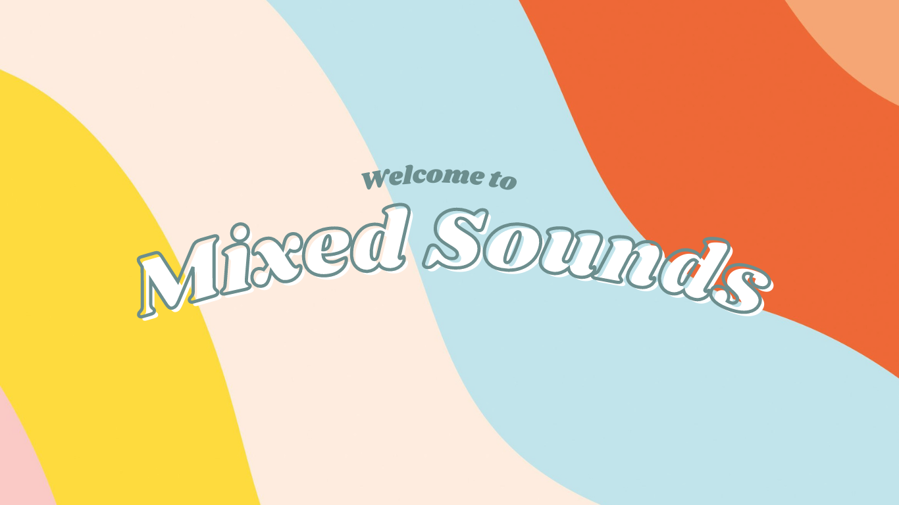

# UI Design

## Wireframe

## Stories

Story #1

User creates an account with a username and password. They are directed to the homepage and hit play to start listening to a song. They play the first song and rate the song 4/5. The user writes a comment about how much they loved it and click submit. The website then proceeds to the next randomly generated song. The user listens halfway through and realizes they are not interested in the song and hits next. The website shows another another song and the user adjusts the volume.

Story #2

The user changes the genre from random to rap and hits next for another song. They are listening to a song and like it so much that they replay the song. Upon rating it, they continue to the next song but want to hear the previous song again so they hit the back button to replay the song. They also decide to add the song to a playlist. They hit the add to playlist button and create a new playlist with a title. They click add and proceed to the next song.

Story #3

The user wants to view their past listening history. They go to the listening history page and view each song and their ratings. They see a rating for a song that they now hate and change its rating.

Story #4

The user wants to listen to their playlists so they go to playlists page and go to a playlist they previously made. The user adds another song by search features and adds to the playlist.

Story #5

The user wants to create a new playlist so they hit the button. They want to create a new playlist based off of their listening history so they filter by songs rated 5/5 and under the genre of pop. The user hits create and a playlist is generated.

## HTML & CSS Mockup

## References

- [Link 1](https://example.com)
- [Link 2](https://example.com)
- [Link 3](https://example.com)